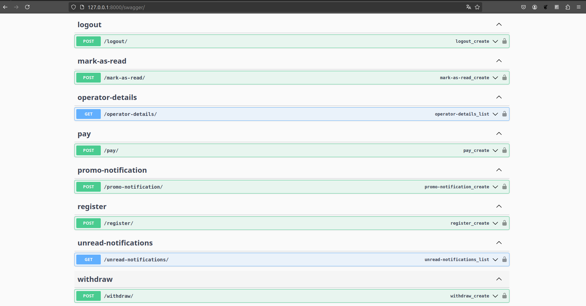

# Bonne Voyage

**Bonne Voyage** is a comprehensive bus booking and payment system designed to streamline the process of reserving bus tickets, managing schedules, and processing payments with real-time updates. The application is built with Django and Django Channels, providing a robust backend for handling various aspects of bus operations, user management, and payment processing in Cameroon.

## Model Relationships


## Key Features

- **User Management:** 
  - Custom user authentication with roles including Customer, Operator(Bus Companies), and Admin.
  - Support for both user and operator profiles with relevant information such as contact details, email, and images.

- **Bus and Route Management:**
  - Full CRUD operations for managing bus details, operators, and routes.
  - Schedule management with unique constraints on departure and arrival times, ensuring accurate and reliable trip planning.

- **Booking System:**
  - Real-time seat availability checks to prevent overbooking.
  - Dynamic pricing calculation based on the number of seats booked.

- **Payment Integration:**
  - Robust payment handling using multiple payment gateways.
  - Celery task notifications to provide real-time payment status updates to users, ensuring transparency and immediacy.
  - Automatic price calculation and validation to ensure accuracy in transactions.

- **Notifications:**
  - Real-time updates on booking and payment statuses.
  - Instant notifications sent to users upon successful booking and payment via WebSocket connections.
 
- ## Custom Dashboards


- ## Swagger Docs





## Tech Stack

- **Backend:** Django,
- **Database:** PostgreSQL
- **Tasks:** Celery tasks with Redis
- **Payment Gateway:** Campay

## Installation and Setup

1. **Clone the Repository:**
   ```
   git clone https://github.com/Brien123/Bonne-Voyage.git
   cd bonne-voyage
   ```

2. **Install Dependencies:**
   ```
   pip install -r requirements.txt
   ```

3. **Run Migrations:**
   ```
   python manage.py migrate
   ```

4. **Start the Server:**
   ```
   python manage.py runserver
   ```

## Usage

After setting up, navigate to the admin panel to manage buses, routes, schedules, and users. Users can sign up, book tickets, and make payments directly from the application. Real-time updates and notifications will keep users informed of their booking and payment status.

## Contribution

Contributions are welcome! Please fork this repository and submit a pull request for any improvements or bug fixes.

## License

This project is licensed under the MIT License.
